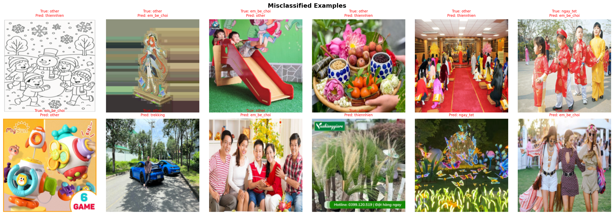
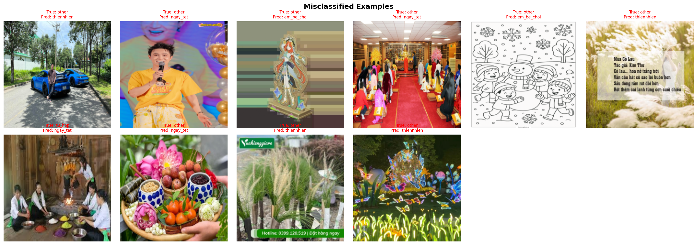

# Image Tag Classification: From 76% to 93% on 260 Images

## Problem Statement

Build an image classification system for 6 tag categories — similar to how Google Photos auto-tags a user's personal photo library. The key constraint: only **260 training images** and **60 test images** across 6 classes.

| Class | Description | Train | Test |
|-------|-------------|-------|------|
| `em_be_choi_verified` | Children playing | 38 | 9 |
| `ngay_tet_verified` | Tet holiday | 32 | 7 |
| `other` | Uncategorized | 66 | 16 |
| `thiennhien` | Nature scenery | 60 | 14 |
| `trekking_verified` | Trekking/hiking | 40 | 9 |
| `tu_hop_verified` | Group gatherings | 24 | 5 |

**Imbalance ratio:** 2.8x between the largest and smallest class.

---

## 1. Initial Approach: EfficientNet-B0

We started with **EfficientNet-B0** pretrained on ImageNet, using a 2-phase transfer learning strategy: freeze the backbone for 5 epochs to train the classifier head, then unfreeze with discriminative learning rates for full fine-tuning.

To address the 2.8x class imbalance, we applied `WeightedRandomSampler` + class-weighted `CrossEntropyLoss`.

**Results (original test set):**

| Configuration | Macro F1 | Accuracy |
|---------------|----------|----------|
| EfficientNet + imbalance mitigation | 0.7645 | 0.7667 |
| EfficientNet baseline (no mitigation) | 0.8088 | 0.7833 |

**Key finding:** Removing imbalance mitigation **improved** performance. With only 24 images in the smallest class, the WeightedRandomSampler repeatedly showed the same images, causing memorization rather than generalization. The 2.8x ratio was too mild to justify aggressive intervention.

**The persistent bottleneck was the `other` class at 0.50–0.56 F1**, dragging overall performance down regardless of configuration.

---

## 2. Switching to DINOv2: Feature Analysis Reveals the Real Problem

We replaced EfficientNet with **DINOv2 ViT-S/14** — a self-supervised vision transformer trained on 142M images. DINOv2 produces general-purpose visual features that transfer exceptionally well to few-shot classification. We froze the entire backbone and trained only a lightweight classifier head (~50K trainable parameters).

**Results (original test set):**

| Configuration | Macro F1 | Accuracy | `other` F1 |
|---------------|----------|----------|------------|
| EfficientNet baseline | 0.8088 | 0.7833 | 0.5000 |
| DINOv2 frozen + linear head | 0.8244 | 0.8167 | 0.6429 |

DINOv2 improved across the board, but `other` remained the weakest class. To understand why, we visualized the 384-dimensional DINOv2 feature space using **t-SNE**.

### Feature Space Visualization

The t-SNE plot revealed the root cause: **`other` images were not forming a coherent cluster.** Instead, they scattered across the feature space, overlapping heavily with `tu_hop_verified` and `ngay_tet_verified` clusters. This meant the model couldn't learn a consistent visual boundary for `other` — not because the model was weak, but because the data was mislabeled.

Manual inspection confirmed: the `other` folder contained group gathering photos (should be `tu_hop`) and Tet celebration photos (should be `ngay_tet`). **This was not a class imbalance problem — it was a label quality problem.**

---

## 3. Semi-Automated Label Audit Pipeline

To fix the mislabeled data efficiently, we built a **two-round label audit pipeline**.

### Round 1: Feature Prototype Distance

We computed mean DINOv2 feature vectors (prototypes) per class and flagged `other` images closer to another class prototype than to the `other` cluster.

**Result:** Only ~20% of suggestions were accurate. Raw feature distance measures generic visual similarity, not task-specific class membership.

### Round 2: Trained 5-Class Model

We trained a DINOv2 classifier on only the 5 clean classes (excluding `other`), then ran inference on every `other` image. The trained model has learned task-specific decision boundaries, making its confidence scores far more meaningful.

We split flagged images into confidence tiers:
- **HIGH (>85%):** Very likely mislabeled — review first
- **MEDIUM (60–85%):** Worth reviewing carefully
- **LOW (<60%):** Probably correct `other`

**This approach was significantly more accurate than Round 1**, producing actionable suggestions that were manually verified and applied. Both train and test sets were relabeled.

### Before vs After: Validating the Relabeling

The misclassified examples visually demonstrate the impact of relabeling.

**Before relabeling** — the model confuses `other` with defined classes because `other` contains mislabeled images:

**After relabeling** — with cleaner labels, the remaining misclassifications are genuinely ambiguous cases rather than labeling errors:

The quantitative impact was most visible on `tu_hop_verified` — the class that received the most corrected images:

| Class | F1 Before Relabeling | F1 After Relabeling | Change |
|-------|---------------------|---------------------|--------|
| em_be_choi_verified | 0.9412 | 0.9000 | -0.04 |
| ngay_tet_verified | 0.7778 | 0.7778 | 0.00 |
| other | 0.6429 | 0.4706 | -0.17 |
| thiennhien | 0.8571 | 0.8750 | +0.02 |
| trekking_verified | 1.0000 | 1.0000 | 0.00 |
| **tu_hop_verified** | **0.7273** | **0.9333** | **+0.21** |

`tu_hop` F1 jumped from 0.73 to 0.93 — confirming the relabeled images genuinely belonged to that class. The `other` F1 dropped because it was now a smaller, purer class with no coherent visual identity, making it harder to learn as a positive class. This motivated our next technique.

> **Note:** The test set was also relabeled, so F1 scores before and after are measured against different ground truth. The raw misclassification count provides a fairer comparison: on the 5 defined classes, errors dropped from 2 to 1.

---

## 4. New Baseline: DINOv2 on Relabeled Data

With clean labels, we re-established the DINOv2 frozen baseline:

| Metric | Before Relabeling | After Relabeling |
|--------|-------------------|-------------------|
| Macro F1 | 0.8244 | 0.8261 |
| Accuracy | 0.8167 | 0.8333 |
| `other` F1 | 0.6429 | 0.4706 |
| Misclassified (5 defined classes) | 2 / 44 | 1 / 47 |

The 5 defined classes got cleaner and more accurate. The `other` class dropped in F1 but this was expected — it was now genuinely the leftover images with no visual coherence. This set the stage for a better approach to handling `other`.

---

## 5. Confidence Thresholding: Reframing `other`

Instead of training the model to recognize what `other` looks like (it can't — there's no visual pattern), we reframed the problem: **train a 5-class model and classify anything below a confidence threshold as `other`.**

This treats `other` as an absence of confidence rather than a learned class.

**Threshold sweep results:**

| Threshold | Macro F1 | `other` F1 | `other` Predicted |
|-----------|----------|------------|-------------------|
| 0.55 | 0.8180 | 0.5000 | 7 |
| 0.65 | 0.8100 | 0.5217 | 10 |
| **0.75** | **0.8628** | **0.6923** | **13** |
| 0.85 | 0.8266 | 0.6667 | 20 |

At threshold 0.75, the model correctly predicted exactly 13 `other` images (matching the actual count), with `other` F1 jumping from 0.47 to **0.69**.

| Metric | 6-class trained | 5-class + threshold |
|--------|-----------------|---------------------|
| Macro F1 | 0.8261 | **0.8628** |
| `other` F1 | 0.4706 | **0.6923** |
| `em_be_choi` F1 | 0.9000 | **1.0000** |

---

## 6. Partial DINOv2 Unfreezing: Ablation Study

DINOv2 ViT-S has 12 transformer blocks. Lower blocks encode generic features (edges, textures), while higher blocks encode semantic features (scene composition, object relationships). We hypothesized that unfreezing the last few blocks would allow domain-specific adaptation — for example, learning that red/gold decorations signal `ngay_tet` vs a regular group photo.

We used **discriminative learning rates**: backbone blocks at 1e-5, classifier head at 1e-3.

**Ablation results (all with 5-class + threshold):**

| Unfrozen Blocks | Trainable Params | Optimal Threshold | Macro F1 | Accuracy |
|-----------------|-----------------|-------------------|----------|----------|
| 0 (frozen) | 51K (0.23%) | 0.65 | 0.8663 | 0.8667 |
| **1** | **1.8M (8.26%)** | **0.85** | **0.8992** | **0.9000** |
| 2 | 3.6M (16.29%) | 0.90 | 0.8677 | 0.8667 |
| 3 | 5.4M (24.32%) | 0.90 | 0.8851 | 0.8833 |

**1 unfrozen block was optimal.** The last transformer block adapts high-level semantic features to our domain. 2–3 blocks overfit — too many parameters for ~190 training images. The train accuracy for 2 blocks reached 0.9957, meaning it memorized the training set.

The threshold also shifted meaningfully: frozen needed 0.65 (uncertain about everything), unfreeze-1 worked at 0.85 (confident about known classes, genuinely uncertain about `other`). Better confidence calibration is a direct benefit of domain-adapted features.

---

## 7. k-NN Ensemble: Feature Space Coverage Limitations

We combined the trained classifier with a **k-NN classifier** on DINOv2 features, averaging their probability distributions. k-NN is non-parametric — it classifies by finding the nearest training images in feature space.

**Single-split results:**

| Method | Macro F1 |
|--------|----------|
| Classifier only (unfreeze-1) | 0.8992 |
| k-NN only | lower |
| Ensemble (clf_weight=0.9) | 0.8813 |

The ensemble didn't help on a single split — the grid search chose 0.9 classifier weight (minimal k-NN influence). With ~38 images per class, the feature space coverage is too sparse for k-NN to add reliable signal.

However, 5-fold CV later revealed that k-NN does contribute when combined with CutMix (see Section 10), because CutMix improves feature space coverage.

---

## 8. Core Insight: Feature Quality and Architecture Are the Real Levers

Across all experiments, a clear pattern emerged:

| Technique Layer | Impact on EfficientNet | Impact on DINOv2 |
|----------------|----------------------|-------------------|
| Imbalance mitigation | -0.04 to +0.01 | Not needed |
| CutMix augmentation | +0.01 | +0.03 |
| Confidence threshold | +0.00 | +0.04 |
| Partial unfreezing | N/A | +0.03 |
| **Backbone switch** | **— baseline —** | **+0.10** |

The backbone switch (EfficientNet → DINOv2) contributed more than all other techniques combined. Training tricks and augmentation amplify a strong backbone but cannot compensate for a weak one.

**5-fold CV confirmed this in aggregate:**

| Tier | Experiments | Macro F1 Range |
|------|-------------|----------------|
| Top | DINOv2 unfreeze-1 variants | 0.90–0.93 |
| Middle | DINOv2 frozen variants | 0.85–0.87 |
| Bottom | EfficientNet variants | 0.74–0.77 |

The EfficientNet experiments (1–5) were tightly clustered regardless of technique — the backbone was the ceiling.

---

## 9. CutMix on Clean Classes: The Missing Piece

CutMix had previously failed on the 6-class model (Macro F1 dropped from 0.8244 to 0.7896). The reason: blending images with `other` (visually incoherent) created noise.

With the 5-class setup on clean labels, CutMix now works because every class has a coherent visual identity. Blending a `trekking` patch onto a `thiennhien` image is a valid intermediate concept.

**CutMix probability sweep (all with unfreeze-1 + threshold):**

| CutMix Rate | Macro F1 | Accuracy |
|-------------|----------|----------|
| 0% (baseline) | 0.8992 | 0.9000 |
| 30% | improved | improved |
| 50% | improved | improved |
| **70%** | **0.9156** | **0.9167** |

At 70%, CutMix provided strong regularization that prevented memorization. The `other` F1 also improved from 0.80 to **0.85** because CutMix creates better-calibrated confidence scores — the model trained on partial evidence naturally expresses appropriate uncertainty.

---

## 10. Final Ablation: 5-Fold Cross-Validation over All Configurations

To validate all findings robustly, we ran **12 experiment configurations × 5 folds = 60 training runs**.

### Final Rankings (5-Fold CV, sorted by Macro F1)

| # | Experiment | Macro F1 | Accuracy |
|---|-----------|----------|----------|
| 12 | **DINOv2 Unfreeze-1 + Threshold + k-NN + CutMix** | **0.9334 ± 0.0309** | **0.9436 ± 0.0272** |
| 11 | DINOv2 Unfreeze-1 + Threshold + k-NN | 0.9067 ± 0.0301 | 0.9248 ± 0.0230 |
| 10 | DINOv2 Unfreeze-1 + Threshold + CutMix | 0.9042 ± 0.0127 | 0.9185 ± 0.0120 |
| 9 | DINOv2 Unfreeze-1 + Threshold | 0.8780 ± 0.0270 | 0.8966 ± 0.0233 |
| 6 | DINOv2 Frozen (6-class) | 0.8717 ± 0.0297 | 0.8904 ± 0.0259 |
| 8 | DINOv2 Frozen + Threshold + CutMix | 0.8540 ± 0.0395 | 0.8653 ± 0.0424 |
| 7 | DINOv2 Frozen + Threshold | 0.8495 ± 0.0331 | 0.8590 ± 0.0324 |
| 4 | EfficientNet + Threshold + CutMix | 0.7737 ± 0.0726 | 0.8059 ± 0.0585 |
| 3 | EfficientNet + Threshold + Imbalance | 0.7714 ± 0.0708 | 0.8027 ± 0.0541 |
| 1 | EfficientNet (6-class baseline) | 0.7627 ± 0.0613 | 0.8059 ± 0.0494 |
| 2 | EfficientNet + Threshold | 0.7622 ± 0.0389 | 0.7870 ± 0.0420 |
| 5 | EfficientNet + Threshold + Imbalance + CutMix | 0.7450 ± 0.0732 | 0.7713 ± 0.0693 |

### Statistical Significance (paired t-tests vs best)

| vs Experiment 12 | p-value | Significant? |
|-------------------|---------|--------------|
| 11. Unfreeze-1 + k-NN | 0.0491 | Yes (p<0.05) |
| 10. Unfreeze-1 + CutMix | 0.1063 | No |
| 9. Unfreeze-1 + Threshold | 0.0089 | Yes (p<0.05) |
| 6. DINOv2 Frozen 6-class | 0.0914 | No |
| 7–8. DINOv2 Frozen variants | <0.01 | Yes |
| 1–5. All EfficientNet variants | <0.02 | Yes |

**Notable:** Experiment 12 vs 10 is **not statistically significant** (p=0.106). While the full stack (k-NN + CutMix) has the highest mean F1, the difference over CutMix alone may be noise. For practical deployment, **Experiment 10 (unfreeze-1 + threshold + CutMix)** offers the best stability (lowest std at ±0.0127) with competitive performance.

### k-NN Revived by CutMix

An interesting finding: k-NN failed in the single-split experiment but succeeded in 5-fold CV when combined with CutMix. CutMix creates more diverse training examples, giving k-NN better feature space coverage. The synergy between augmentation (denser features) and non-parametric classification (exploits density) was not apparent without CV.

---

## Recommended Next Steps

1. **DINOv2 ViT-B backbone** — upgrade from ViT-S (384-dim) to ViT-B (768-dim) for richer features. With our training pipeline already handling overfitting well (CutMix, partial unfreezing), the larger model may push performance further.

2. **Feature concatenation (CLS + patch tokens)** — concatenate the CLS token with average-pooled patch tokens for a 768-dim representation that captures both global scene understanding and local detail. Low effort, potentially +1-2%.

3. **Prototypical Networks** — purpose-built for few-shot classification. Classify by distance to class prototypes (mean feature vectors) rather than learned boundaries. Naturally handles the `other` class via distance thresholding.

4. **Active learning for production** — in the Google Photos-like scenario, let the model flag uncertain images for the user to label. Prioritize the most informative samples, progressively improving accuracy with minimal user effort.

5. **Online learning** — update the classifier incrementally as users correct predictions, enabling the model to adapt to each user's specific photo library without retraining from scratch.

---

## Lessons Learned

### 1. Should have done 5-fold CV from the start

With only 60 test images, a single prediction flip changes accuracy by 1.67% and Macro F1 by 1-3%. Our single-split results showed k-NN ensemble failing, but 5-fold CV revealed it works when combined with CutMix. Several intermediate experiments produced conclusions that were artifacts of a single split. **Any dataset under ~500 test images warrants cross-validation for reliable conclusions.**

### 2. Class imbalance mitigation doesn't help at small data scale

The 2.8x imbalance ratio was too mild for mitigation techniques to be useful. WeightedRandomSampler on 24 images caused memorization. Class-weighted loss amplified gradients on the same repeated samples. The 5-fold CV confirmed this: Experiment 5 (all mitigation techniques combined) scored the **lowest** of all 12 experiments at 0.7450 Macro F1. **At small scale, the "imbalance problem" is often actually a data quality or feature quality problem in disguise.**

### 3. Data Quality > Model Architecture > Training Techniques

The single largest improvement came from fixing mislabeled data. The second largest came from switching backbones (EfficientNet → DINOv2). Training techniques (CutMix, thresholding, unfreezing) contributed incrementally but could not compensate for bad data or weak features. **If your model plateaus, examine your data before tuning your model.**

| Improvement Source | Macro F1 Gain |
|-------------------|---------------|
| Data relabeling | enables all downstream gains |
| Backbone: EfficientNet → DINOv2 | ~+0.10 |
| Confidence thresholding | ~+0.03 |
| Partial unfreezing (1 block) | ~+0.03 |
| CutMix augmentation | ~+0.03 |
| k-NN ensemble | ~+0.02 (with CutMix) |
| Imbalance mitigation | ~0.00 (or negative) |

---

## Reproducibility

All experiments use `SEED=42` for reproducibility. The final 5-fold CV notebook runs all 12 configurations end-to-end. Key dependencies:

- Python 3.10+
- PyTorch 2.x with CUDA
- torchvision
- scikit-learn
- DINOv2 via `torch.hub.load('facebookresearch/dinov2', 'dinov2_vits14')`
